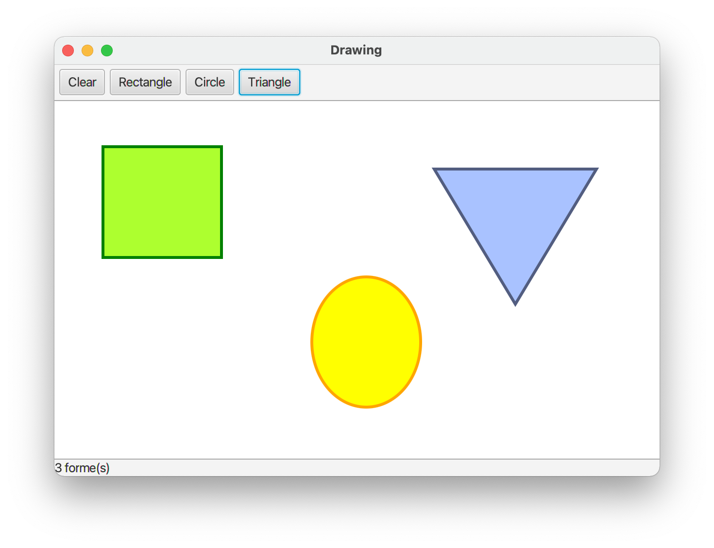

# Minipaint 
## TP2 – De l'observer

Le patron *Observer* est certainement le plus couramment utilisé. Il est d’ailleurs déjà utilisé à plusieurs reprises dans notre application, mais on découvrira cela tout à l’heure. D’abord, nous allons implémenter le patron *Observer* pour ajouter une nouvelle fonctionnalité à l’application. 

On veut rajouter une barre de statut horizontale, en bas de la fenêtre. Cette barre indiquera le nombre de formes géométriques dessinées, et devra être mise à jour à chaque forme ajoutée ou supprimée. 

>**🖥 TODO**
>
> - Commencez par créer une nouvelle classe `StatutBar`, qui héritera de `HBox`, et qui contiendra un attribut de type `Label` dans lequel on affichera le nombre de formes.
> - Ajoutez une instance de cette classe dans l’interface, en la positionnant en bas de la fenêtre. Inspirez-vous du style CSS de la barre d’outils pour lui appliquer un style similaire (mais cette fois avec une bordure en haut).

La barre de statut est bien créée, mais pour l’instant elle « ne sait rien » des formes qui sont dessinées. 🤷🏼‍♂️

Reprenez l’exemple vu en cours illustrant le fonctionnement du patron *Observer* et cherchez à l’appliquer notre problème : 

>**🖥 TODO**
>
> -	 Identifiez le ***sujet*** (« émetteur », ou « observable ») : quelle est la classe qui contient l’information clé, et qui pourra avertir les autres qu’il y a eu un changement ?
> - Qui est l’***observateur*** (ou « abonné », ou « observer ») qui doit recevoir les notifications, être mis à jour ? 

  

🏅 Excellent, vous avez identifié les deux classes impliquées dans ce patron ! Il ne reste plus qu’à coder : 

>**🖥 TODO**
>
> -	 Créez une interface `Observer`, contenant la méthode :
>
		public void update() ;
> 
> - Modifiez les deux classes identifiées précédemment :
>  - Le ***sujet*** doit pouvoir gérer une liste d’observateurs (on doit pouvoir en ajouter, en retirer), et les notifier lorsqu’il effectue un changement. 
>  - L’***observateur*** doit implémenter l’interface `Observer`
> - Finalement, n’oubliez pas que l’observateur doit s’abonner auprès du sujet pour recevoir les notifications !
> - Ah oui, dernière chose : pensez à créer un test pour vérifier le bon fonctionnement de votre barre de statut… 

 

### 🦸🏻‍♂️ Un patron déguisé
---
En réalité, le patron *Observer* est déjà utilisé à plusieurs reprises dans l’application ! Par exemple, intéressons-nous à la classe `ClearButtonHandler`. Cette classe implémente l’interface `EventHandler`, du package `javafx.event`. 

>**🖥 TODO**
>
> -	 À quoi sert la classe `ClearButtonHandler` ?
> - Quel est l’objectif de la méthode `handle` proposée par l’interface `EventHandler` ?
> - À quel moment sera appelée la méthode `handle` ?
> - Comment le lien est-il fait entre la classe `ClearButtonHandler` et le bouton de l’interface ?
> - Quel parallèle pouvez-vous faire avec le patron *Observer* ? 

  

Creusons encore un peu et cherchons à comprendre le fonctionnement de la classe `ShapeButtonHandler` et de ses sous-classes, comme `RectangleButtonHandler`. 

>**🖥 TODO**
>
> -	 Quels sont les différents événements que la classe `RectangleButtonHandler` écoute, et quelles sont leur provenance ? Repérez les différents endroits où cette classe (ou sa super-classe) s’enregistre pour écouter ces événements.
> - Reconstituez le diagramme de séquence décrivant ce qui se passe lors de la création d’un nouveau rectangle, depuis le clic sur le bouton « Rectangle ».

  
En fait, la classe `RectangleButtonHandler` est très curieuse : elle observe beaucoup de choses !! 🦹🏼‍♀️

 

[🔙 Retour](../README.md)