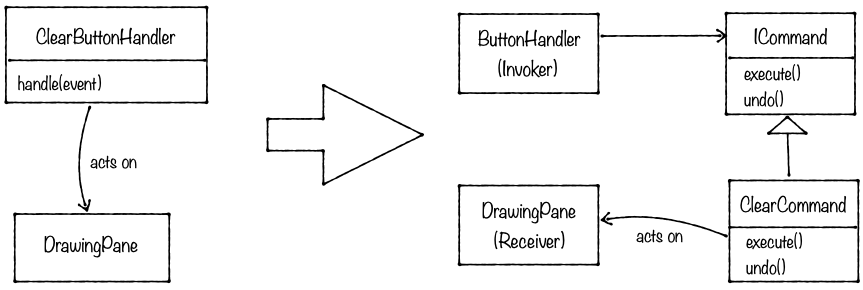

# Minipaint 
## TP6 – Le patron Command 

Jusqu’ici, toutes les actions sont déclenchées à partir de clics sur des boutons et/ou sur le `DrawingPane`. Le code métier définissant chaque action est écrit dans les « *handler* » correspondants (`ClearButtonHandler`, `RectangleButtonHandler`, etc), ce qui n’est pas très élégant. Pour ajouter de la flexibilité à la façon dont les actions sont déclenchées, et aussi pour pouvoir implémenter un mécanisme de type undo/redo, nous allons nous intéresser au patron *Command*. 

La vidéo de Christopher Okhravi est disponible [ici](https://www.youtube.com/watch?v=9qA5kw8dcSU) 📺

Le principe de ce patron consiste à encapsuler les actions (ou « commandes ») dans des objets. En fait, cela revient à extraire le code métier des « *handler* », dans des objets indépendants : on sépare le code qui déclenche l’action du code de l’action elle-même. 

Pour y parvenir, nous allons procéder en plusieurs étapes.

### 🕹 1.	L’interface `ICommand`
--- 
>**🖥 TODO**
>
> - Créer l’interface `drawing.commands.ICommand`, contenant deux méthodes sans paramètres `execute()` et `undo()`. 

 

### 🛍 2.	Création des commandes 
---
Pour chaque « *handler* » correspondant à une action, nous allons extraire le code de l’action et en faire une commande. Cette transformation peut être schématisée par le diagramme suivant (commencez par le `ClearButtonHandler`, c’est le plus facile) :

Pour cela, procédez comme suit :
>**🖥 TODO**
>
> - Dans le *handler*, identifiez le code correspondant à l’action à effectuer, et le « récepteur » (*receiver*) de l’action (ce sur quoi l’action agit).
> - Créez une classe correspondant à cette action, qui implémente l’interface `ICommand` et qui contient un attribut correspondant au récepteur de l’action, ainsi que le code de l’action proprement dite (dans la méthode `execute`).
> - Implémentez la méthode `undo` (qui doit faire l’inverse de `execute`). Il faudra peut-être stocker quelques informations supplémentaires au moment du `execute` pour savoir quoi « défaire » lors du `undo`. 
> - Dans le *handler*, ajoutez un attribut de type `ICommand`. Sa valeur sera récupérée au moment de l’instantiation du *handler*. 
> - Dans le code du *handler*, remplacez le code de l’action par un appel à la méthode `execute` de la commande précédemment créée. 
> - Vérifiez que l’action fonctionne toujours !

  

### ⏮ 3.	Undo
---
Puisque chaque commande sait annuler son action (grâce à la méthode `undo`), il suffit maintenant de se rappeler la liste des commandes exécutées pour être capable de les annuler les unes après les autres. 

>**🖥 TODO**
>
> - Pour cela, créez une classe `drawing.commands.CommandHistory`, qui contiendra une pile de commandes. Elle proposera également 2 méthodes publiques : une méthode `exec(ICommand)` qui prend en paramètre une commande, qui l’ajoute à la pile de commandes et qui l’exécute ; et une méthode `undo()` qui enlève la dernière commande de la pile et qui demande son annulation. 
> - La classe `DrawingPane` contiendra un attribut de type `CommandHistory`, qui sera rendu accessible grâce à un *getter* public.
> - Modifiez les *handlers* de telle sorte qu’ils n’appellent plus directement la méthode `execute` sur les commandes, mais plutôt qu’ils fassent appel à la méthode `exec` de la classe `CommandHistory`.
> - Ensuite, ajoutez un bouton dans la `Toolbar` qui permet d’annuler les actions (et qui fait donc appel à la méthode `undo` de la classe `CommandHistory`).

  

### 🐞 4.	Debug
---
Enchainez les actions suivantes :

-	Créez un cercle
-	Effacez tout 
-	Créez un rectangle
-	Effacez tout
-	Annulez 3 fois

>**🖥 TODO**
>
> - Que constatez-vous ? D’après vous, où se situe le problème ? 
> - Quelle solution proposez-vous pour corriger ce bug ?

  

### 🤖 5.	Redo
---
>**🖥 TODO**
>
> - Inspirez-vous de ce que vous avez fait pour réaliser le undo afin d’implémenter la fonction « redo ». 

 

[🔙 Retour](../README.md)