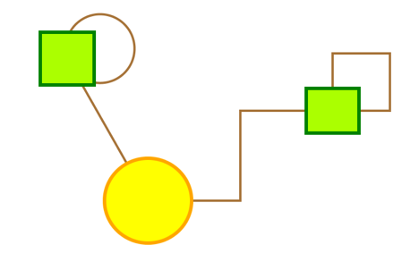

# Minipaint 
## TP9 – Changement de stratégie

### 🎸 The Edge : la suite
--- 
On voudrait pouvoir dessiner plusieurs sortes de traits (droits, courbes, orthogonaux, etc), et être capable de changer dynamiquement le type d’un trait. 

>**🖥 TODO**
>
> - Expliquer pourquoi étendre la classe `Edge` avec plusieurs sous-classes (une par type de trait) ne serait pas une bonne solution.

Dans la classe `Edge`, on va commencer par remplacer le type `Line` (utilisé pour dessiner un trait) par le type `Path`. 

>**🖥 TODO**
>
> - Faites les modifications nécessaires. 

Maintenant, pour pouvoir gérer plusieurs sortes de trait, on va utiliser le patron *Strategy*. On aura une stratégie par type de trait. Chaque stratégie sera dédiée à construire un `Path`. Documentez-vous sur ce patron pour comprendre son fonctionnement (une [petite vidéo](https://www.youtube.com/watch?v=v9ejT8FO-7I&t=15s) 📺 ?)

L’interface `IEdgeStrategy` aura une seule méthode :  

	void buildPath(IShape from, IShape to, Path path);

Chaque stratégie implémentera cette méthode en vidant les éléments du path passé en paramètre, et en le remplissant avec les éléments correspondant au calcul du nouveau trait. 

Une stratégie sera passée en paramètre du constructeur de la classe `Edge`, et il sera aussi possible d’en changer grâce à une méthode `setEdgeStrategy(IEdgeStrategy strategy)`. Lorsqu’une nouvelle stratégie sera appliquée à un `Edge`, alors on recalculera par la même occasion le `path` correspondant. 

>**🖥 TODO**
>
> - Commencez à implémenter une stratégie simple, qui consistera à simplement tracer un trait droit entre les deux formes. 
> - Implémentez une deuxième stratégie, permettant de tracer une liaison orthogonale entre 2 formes sélectionnées. 
> - Créer une commande qui permet d’appliquer une stratégie donnée aux objets de type `Edge` sélectionnés (la stratégie sera passée en paramètre du constructeur de la commande). 
> - Dans la `ToolBar`, on va rajouter un objet de type `ComboBox` qui contiendra la liste des stratégies possibles. Lorsqu’on va sélectionner une stratégie, elle sera appliquée à tous les objets de type `Edge` qui sont sélectionnés, grâce à l’exécution de la commande correspondante. 

Évidemment, quelques ajustements sont nécessaires pour pouvoir récupérer le « milieu » du trait (grâce aux méthodes `centerXProperty` et `centerYProperty`). En effet, ces informations dépendent du type de trait. 

>**🖥 TODO**
>
> - On va donc ajouter deux méthodes à l’interface `IEdgeStrategy` :
>
		public ObservableValue middleXProperty();
		public ObservableValue middleYProperty();

> - On fera appel à ces méthodes dans la classe `Edge`.  

#### 🛵 Un peu plus loin…
>**🖥 TODO**
>
> - Si une seule forme est sélectionnée, alors on doit pouvoir dessiner un lien sur la forme elle-même. 

 

[🔙 Retour](../README.md)